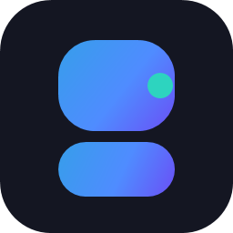

# DeckForge



A native Windows visual studio for building **[Macro Deck 3](https://macro-deck.app/)** plugins - the MCreator-style generator: design your plugin in guided editors, and DeckForge generates the exact official plugin project, verified against the real `macrodeck-plugin` toolchain.

> Independent tool. Not affiliated with the Macro Deck project; Macro Deck is a trademark of its owner. See **[ROADMAP.md](ROADMAP.md)** for shipped work and what's next.

## Status (all core stages implemented)

- **Project generator** reproducing the official Macro Deck plugin template layout,
  pinned to Macro Deck SDK **3.0.0-beta.14**, with instant open + jump to Build & Run.
- **Manifest Studio**: full live editor (identity, publication, compatibility, platforms,
  permissions) with debounced native validation beside the raw JSON.
- **Capability Gallery**: all 23 documented capabilities as cards with docs deep links, each with
  real SDK scaffolding behind its "Add to plugin" button.
- **Explorer**: file tree of the open workspace (opens files with their default app).
- **Visual editor**: the block canvas — 156 blocks across 11 categories, drag or keyboard placement,
  an inspector that edits every field type, click-through diagnostics, a live generated-C# pane, and
  save/reload that restores a canvas exactly. It supersedes the earlier Block Programmer page.
- **Visual editors**: Actions (29 editor types), Events (config + payload parameters)
  and Setup Flows (multi-step, OnlyWhen, OAuth secret) all generate real SDK classes with
  resx strings, permissions and PluginIntegration registration.
- **Widget Designer v2**: two-region editor (widget vs config surface), reorderable node
  tree, per-node events, button states, JSON Schema builder, live 144 px preview -
  generates IWidgetTypeProvider + IUiProvider serving both surfaces.
- **Offline docs**: one-click versioned snapshot of docs.macro-deck.app
  (~125 pages + assets, stored under %LOCALAPPDATA%/DeckForge/docs) read through a
  virtual host mapping, with full-text search; docs buttons on every editor page.
- **Icon Studio**: SVG template gallery, color pickers, live 144/64 px WebView2 preview,
  save straight into `Assets/icon.svg`.
- **Build & Run**: build/test/run-stub/package buttons streaming real tool output.
- **Ship**: package -> validate -> inspect -> verify -> keygen/sign pipeline with console.
- **Publish**: Store Gate checklist, release.yml writer, `gh release create`, portal link.
- **Terminal**: command console with workspace cwd, history and streamed colored output.
- **Docs**: embedded WebView2 browser at docs.macro-deck.app with deep links from cards.
- **Liquid UI**: Mica/Acrylic, elevation-separated cards, 6 accents, dark/light/system.

### Verified end-to-end

The generator's output was built and exercised with the genuine toolchain:

```
dotnet build                                    -> 0 errors, 0 warnings (real SDK packages)
dotnet test                                     -> harness tests pass
macrodeck-plugin build --source . --output ..   -> packed .macroDeckPlugin
macrodeck-plugin validate --artifact ...        -> 0 error(s), 0 warning(s)
macrodeck-plugin inspect --artifact ...         -> correct identity/entrypoints/languages
macrodeck-plugin test --project ...             -> all Required conformance checks PASS
macrodeck-plugin run --stub-host                -> "Session established (plugin protocol v3)"
```

- **Packaging**: Velopack - installer, portable build and delta auto-updates
  ("Velopack releases" on the Ship page; update checks in Settings). Release from source
  with:

```bash
dotnet tool install -g vpk
dotnet publish src/DeckForge.App -c Release -r win-x64 -o velopack/publish
vpk pack --packId DeckForge --packVersion 0.1.0 \
  --packDir velopack/publish --outDir velopack/out \
  --icon src/DeckForge.App/Assets/app-icon.ico
```

## Building DeckForge

Requirements: Windows 10/11, .NET 10 SDK.

```bash
dotnet build DeckForge.slnx
dotnet test tests/DeckForge.Tests
dotnet run --project src/DeckForge.App
```

## Solution layout

```
src/DeckForge.Core        Domain model, capability catalog, extension contracts, Macro Deck rules
src/DeckForge.CodeGen     Project generation: stock template factory + contributor pipeline
src/DeckForge.Validators  Native manifest/localization validators
src/DeckForge.CliAdapter  ProcessRunner + typed macrodeck-plugin / dotnet wrappers
src/DeckForge.App         WPF-UI shell, liquid theme, pages, view models
tests/DeckForge.Tests     Unit tests (generator output, validators, rules)
```

See **[EXTENDING.md](EXTENDING.md)** for how to add capabilities, pages, validators and
tool commands - the codebase is built for additive extension.

## Roadmap

| Milestone | Scope |
|---|---|
| M2 | Manifest Studio (live editing) + capability editors (Actions, Variables, Events, Config Flows, ...) |
| M3 | ~~Block programmer (Scratch-style canvas)~~ — superseded by the Visual editor, which keeps the `<macrodeck-blocks>` marker round-trip |
| M4 | Stub/real-host run UX, pairing checklist, conformance report viewer |
| M5 | Package/Sign/Verify/Install UX, icon-pack bundling |
| M6 | Widget & Macro Deck UI designer (24 node types, live tile preview) |
| M7 | Icon Studio (SVG) + icon pack designer + localization manager |
| M8 | GitHub release automation + Store Gate + Creator Portal checklist |
| M9 | Offline docs engine + onboarding/resume assistant |
